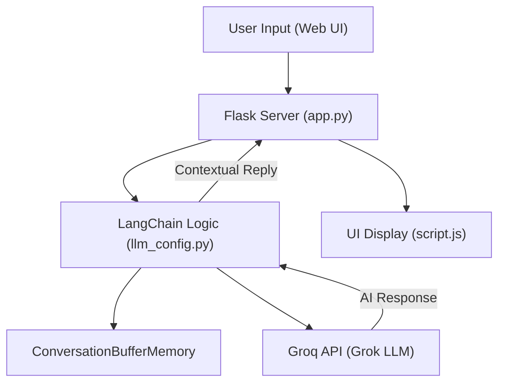

# 🤖 ChatBot AI Assistant (Grok + LangChain)

A high-performance, full-stack AI Chatbot built with **Flask** and **LangChain**, utilizing the **Groq (Grok)** API for lightning-fast intelligent responses. This assistant features persistent conversation memory and a sleek, modern UI.

---

## 🚀 System Architecture & Workflow

The following diagram illustrates how your message travels from the browser to the LLM and back:




1. **User Input**: User types a message. The UI remains clean until the first interaction.
2. **Smart Greeting**: On the 1st interaction, the system prepends: *"Hello Tooba 👋 I am your AI assistant."*
3. **Context Awareness**: `ConversationBufferMemory` ensures the AI remembers previous parts of the chat.
4. **Inference**: Powered by Groq's `gpt-oss-120b` for near-instant execution.

---

## 🛠️ Tech Stack

* **Backend:** Python, Flask
* **AI Framework:** LangChain (v0.3.10)
* **LLM Provider:** Groq (Grok)
* **Frontend:** HTML5, CSS3 (Modern Dark Theme), JavaScript (ES6)

---

## 🔧 Setup & Installation

### 1. Prerequisites

* Python 3.10+
* Groq Cloud API Key

### 2. Clone & Install

```bash
git clone [https://github.com/ToobaRani01/LLM_Chatbot_001.git](https://github.com/ToobaRani01/LLM_Chatbot_001.git)
cd LLM_Chatbot_001
pip install -r requirements.txt

```

### 3. Environment Configuration

Create a `.env` file in the root folder:

```env
Grok_API_KEY=your_groq_api_key_here

```

---

## 🏃 Running the Application

Execute the following command in your terminal:

```bash
python app.py

```

Visit `http://127.0.0.1:5000` to start the conversation.

---

## 📁 Project Directory

```text
├── app.py              # Flask server & Routing logic
├── llm_config.py       # LangChain setup & LLM initialization
├── templates/
│   └── index.html      # Frontend structure
├── static/
│   ├── style.css       # Custom dark-theme styling
│   └── script.js       # Asynchronous API handling
├── .env                # API Keys (Keep Private!)
└── requirements.txt    # Project dependencies

```

---

## 🛡️ Best Practices Included

* **Security:** `.gitignore` included to prevent API key leaks.
* **Accuracy:** LLM `temperature` set to `0.3` for factual and precise responses.
* **UI/UX:** Responsive design with "Enter to Send" functionality.

---

Created with ❤️ by [Tooba Rani](https://www.google.com/search?q=https://github.com/ToobaRani01)

```
